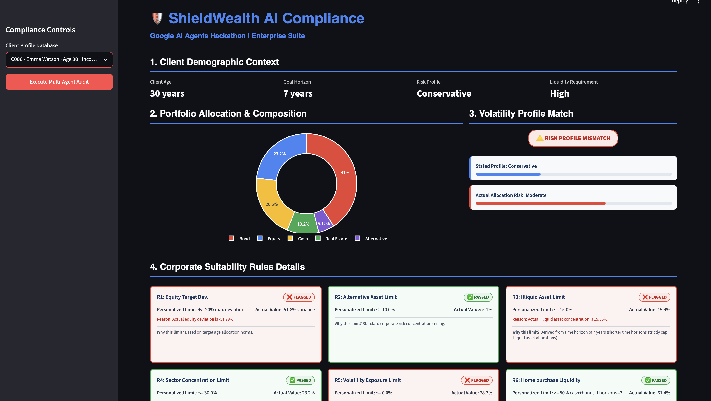
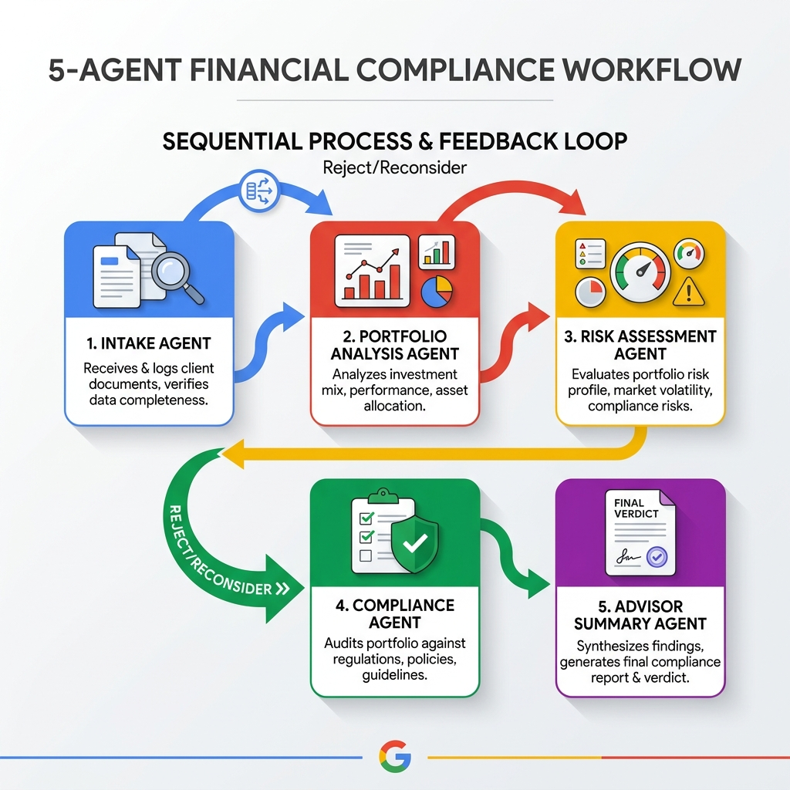
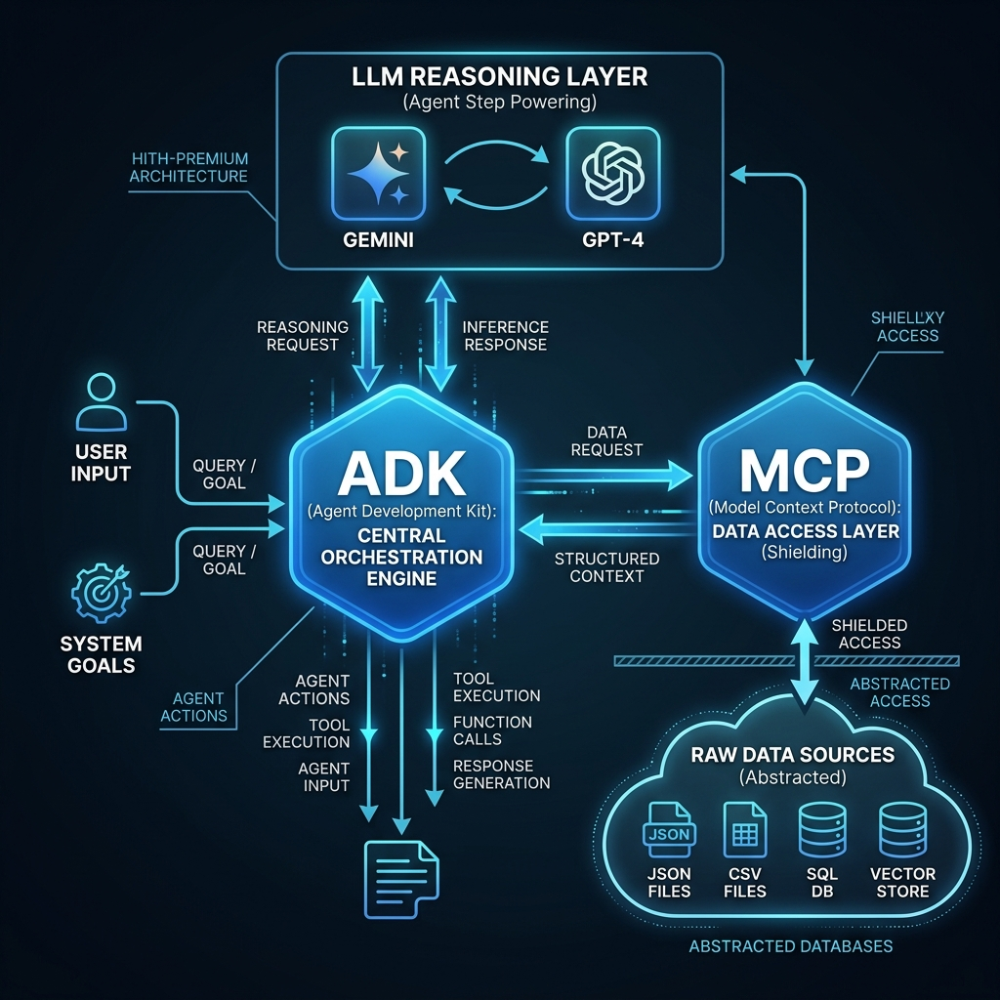

# ShieldWealth AI: Ultra-Personalized Compliance & Wealth Advisory Agent System

A compliance auditing and ultra-personalized wealth management platform built for the **Google AI Agents Hackathon**. Powered by the **Google Agent Development Kit (ADK)** and the **Model Context Protocol (MCP)**, ShieldWealth AI enables financial firms to deliver high-quality, customized wealth advice at scale without compromising fiduciary standards or regulatory compliance.

---

## Dashboard Showcase
Below is a mockup of the visual-first dashboard layout for the ShieldWealth AI platform:



---

##  Problem Statement & Opportunity

### Issue & Opportunity
Traditionally, wealth management firms segment clients into broad, static categories—by age, income, or risk tolerance—and offer standardized, one-size-fits-all advice. This standardized approach limits personalization, ignores the dynamic changes in an individual's life (such as a pending home purchase or short-term liquidity needs), and overlooks critical portfolio risk nuances. 

Furthermore, high-quality, custom-tailored financial advice is usually reserved exclusively for high-net-worth clients because it is operationally expensive and resource-intensive to deliver at scale. As expectations shift toward cost-efficiency and deep personalization, wealth management firms need a way to automate and deliver highly customized advisory services at a lower cost—while maintaining strict fiduciary oversight.

### How ShieldWealth AI Helps
ShieldWealth AI resolves these challenges using a specialized team of agentic AI systems that coordinate to build client profiles, analyze assets, audit compliance, and propose rebalancing advice:
1. **Personal Financial Analysis (Intake)**: A dedicated **Intake Agent** dynamically parses client profiles (age, time horizon, goals, risk tolerance) to construct a detailed personal profile.
2. **Planning & Strategy Generation**: A **Portfolio Analysis Agent** synthesizes holdings and target allocation norms, calculating target deviations and rebalancing requirements.
3. **Compliance Integration**: A **Compliance Agent** audits the portfolio against corporate regulations using dynamic thresholds personalized to the client's own investment goal and timeline.

---

##  Managing Risk & Promoting Trust

To ensure safety and reliability, ShieldWealth AI implements three core architectural principles:
* **Transparent & Explainable**: Portfolio audits provide clear, deterministic reasons for breaches. Every audit generates a formal, downloadable PDF Compliance Suitability Report with structured audit rationales and required reallocation directions.
* **Fair & Impartial**: The system calculates targets and rebalancing shifts strictly using offline target metrics and corporate risk rules. It remains fully offline and independent of live external product feeds, preventing steerage towards biased vendor-preferred products or specific asset classes.
* **Private & Secure**: The system runs entirely locally. By keeping the LLM calls routed through local mocked wrappers and loading sensitive CSV client and holdings data offline, client confidentiality is completely preserved.

---

## System Architecture

ShieldWealth AI uses a sequential multi-agent team coordinated through the ADK session state:

### 1. Multi-Agent Interaction Workflow
The five specialized agents coordinate in a sequential loop to execute profile structuring, asset parsing, risk checking, compliance auditing, and rebalance memo generation. The loop-back reconsider capability between the Compliance Agent and the Portfolio Analysis Agent enables true agentic negotiation rather than standard script-like execution:



### 2. Under the Hood: Technical Orchestration Architecture
* **Orchestration Layer**: Google ADK structures agent orchestration, typed session state exchanges, and step execution.
* **Data Access Layer**: The Model Context Protocol (MCP) server exposes standardized tools that provide agents with access to shared configuration data—including suitability rules and age-based allocation benchmarks—allowing every agent to retrieve a single source of truth for compliance policies without directly accessing the underlying JSON files.
* **Reasoning Layer**: Gemini and GPT-4 power the natural language inference steps and recommendation drafting.



### Agent Roles & Decoupled State Coordination
Agents do not communicate directly; instead, they operate as pure functional units that read from and write to the typed session state keys:

| Agent Name | State Key Written | Functional Responsibility |
|:---|:---|:---|
| **Intake Agent** | `client_profile` | Retrieves client profile data via MCP tools and registers demographics. |
| **Portfolio Analysis Agent** | `portfolio_metrics` | Computes current asset concentrations and target variance against age-based target allocation norms. |
| **Risk Assessment Agent** | `risk_flags` | Checks high-volatility asset holdings against stated risk tolerances and flags mismatches. |
| **Compliance Agent** | `compliance_result` | Audits the portfolio dynamically against corporate regulations and outputs pass/fail details. |
| **Advisor Summary Agent** | `final_summary` | Consolidates all state keys into a structured executive verdict JSON (Health Score, Priority, Rebalancing Shifts). |

---

## Personalization Rules Engine

ShieldWealth AI makes compliance thresholds **personalized** rather than flat and static:

* **Rule 1 (Equity target deviation)**: Assesses if actual equity exposure deviates from the client's dynamic target age allocation norms (e.g., target equity caps decrease as age increases).
* **Rule 2 (Alternative asset limit)**: Imposes a standard corporate ceiling of $\le 10\%$ total alternatives.
* **Rule 3 (Horizon-based illiquidity cap)**: Dynamic limit scaling with `time_horizon_years` (e.g., capped at 5% for short horizons to secure capital; up to 25% for long retirement horizons).
* **Rule 4 (Sector concentration cap)**: Caps any single sector allocation at 30% (e.g., prevents technology concentration).
* **Rule 5 (Profile-based volatility cap)**: Dynamic threshold scaling with `stated_risk_tolerance` (e.g., conservative profiles allow 0% high-volatility assets, moderate profiles allow up to 20%).
* **Rule 6 (Goal-based short-term liquidity)**: If the client's goal is a `home_purchase` and the timeline is $\le 3$ years, Cash + Bonds must make up $\ge 50\%$ of the portfolio to protect purchase capital.

---

##  Setup & Installation

### Prerequisites
* **Python**: 3.10 or higher
* **Package Manager**: [uv](https://github.com/astral-sh/uv) (recommended for fast dependency resolution)

### 1. Install Dependencies
Initialize and sync the virtual environment using `uv`:
```bash
uv sync
```

### 2. Run the Streamlit Dashboard
Launch the visual-first dashboard:
```bash
uv run streamlit run app.py
```
Open `http://localhost:8501` in your browser.

### 3. Run Standalone Agent Pipeline Tests
Run the standalone multi-agent pipeline tests for specific clients using the local mock model:
```bash
# Test Priya Sharma (C001 - Pass case)
uv run python test_full_pipeline.py C001

# Test James Anderson (C002 - Red Flagged case)
uv run python test_full_pipeline.py C002
```

---

##  Client Evaluation Scenarios

### Priya Sharma (Client `C001`) — `PASSED`
* **Profile**: Age 34, Moderate Risk, Retirement Goal (25-year horizon).
* **Audit Result**: Portfolio has no compliance breaches. Actual equity (59.09%) is within target deviations of age benchmarks.
* **Dashboard Summary**: Displays **Portfolio Health Score: 100/100** and **Recommendation Priority: Low**.

### James Anderson (Client `C002`) — `FLAG/REJECT`
* **Profile**: Age 58, Conservative Risk, Home Purchase Goal (2-year horizon).
* **Audit Result**: Triggers 5 compliance breaches (R2, R3, R4, R5, R6). Holds 72.58% in high-volatility assets and has only 4.84% cash+bonds for a short-term purchase.
* **Dashboard Summary**: Displays **Portfolio Health Score: 25/100**, **Recommendation Priority: High**, and computes an exact rebalancing shift recommendation to move ~37.1% ($115,000) from high-tech equities/alternatives into liquid cash/bonds.
